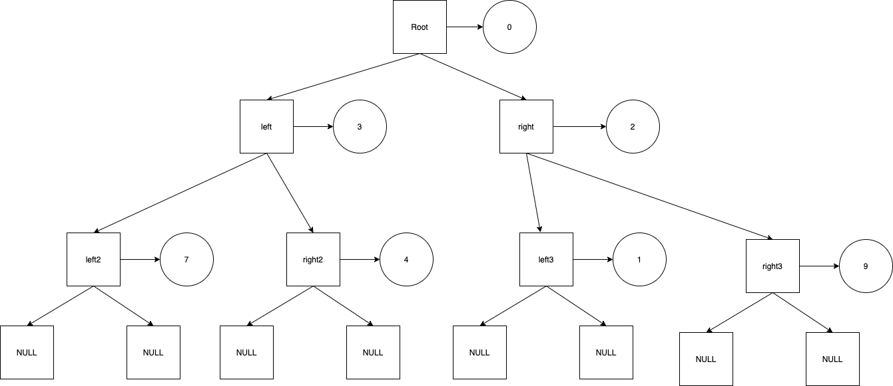

# Prolem 3 - *(Human Compiler)(Hand-written)


## Problem 3-(a) Swaps two arrays using pointers


```c
int fake_a[] = {1,3};
int fake_b[] = {2,4};
int *real_a = fake_a;
int *real_b = fake_b;

for(int i=0;i<2;i++)
    printf("%d", *(real_a + i));
for(int i=0;i<2;i++)
    printf("%d", *(real_b + i));

int *tmp = real_a; //tmp is a pointer to pointer
real_b = fake_a;  // fill the blanks
real_a = fake_b;  // fil the blanks

for(int i=0;i<2;i++)
    printf("%d", *(real_a + i));
for(int i=0;i<2;i++)
    printf("%d", *(real_b + i));
```

Test at: https://onlinegdb.com/SJ4JFi-7_


---

## Problem 3b - An array supporting negative indices


```c
#include <stdio.h>
#define MINN -50
#define MAXN 50

int main(){
    int storage[MAXN - MINN + 1] = {0}; // 101
    int *ary = storage - MINN ; //fill the blank

    for(int i=MINN;i<=MAXN;i++)
        ary[i] = i;
    for(int i=MINN;i<=MAXN;i++)
        printf("%d", ary[i]);
    return 0;
}
```
Verified at: https://onlinegdb.com/rydhl3W7u


## Problem 3C: Tranverses data nodes in a linked list.


```c
#include <stdio.h>
#include <stdlib.h> //malloc /free
#include <memory.h> //memset

//use typedef to substitute "struct node with "node""
typedef struct node {
    int data;
    struct node *left, *right;
} node;

//creates a node filledwith predefined values
node* alloc(int data, node *left, node *right){
    node *tmp = (node*)malloc(sizeof(node));
    tmp->data = data,
    tmp->left = left;
    tmp->right = right;
    return tmp;
}

//traverses (遍歷) the nodes recursively
void traverse(node* root){
    if ((root->left != NULL) & (root->right != NULL)){
        printf("%d", root->data);
        traverse(root->left);
        traverse(root->right);
    }
}

//frees the nodes recursively
void destroy(node *root){
    if ((root->left != NULL) & (root->right!=NULL)){
        destroy(root->left);
        destroy(root->right);
        //clean sensitive data
        memset(root, 0, sizeof(root));
        free(root);
    }
}

int main(){
    // creates a hierarchical data structure
    node *root = \
        alloc(0,
            alloc(3,
                alloc(7, NULL, NULL),
                alloc(4, NULL, NULL)
            ),
            alloc(2,
                alloc(1, NULL, NULL),
                alloc(9, NULL, NULL)
            )
        );
}
```
Verify at: https://onlinegdb.com/B1eRPFnbXd


---

## Notes

### Null Pointer and `Segmentation fault`

- Segmentation fault: 
    > Segmentation fault is a specific kind of error caused by accessing memory that “does not belong to you
- NULL Pointer
    > People assign NULL to pointer to indicate that it points to nothing.

### Read Only String and its Dynamical type

- `char* str` Read only: able to share among functions
    ```c
    char *str = "gfg"; 
    ```
    Read only. `str[0]=a` leads to segmentation fault. Noted that read-only string can be passed among functions:
    ```c
    char *getString(){
    char *str = "GfG"; /* Stored in read only part of shared segment */

    /* No problem: remains at address str after getString() returns*/
    return str; 
    }	 

    int main(){
    printf("%s", getString()); 
    getchar();
    return 0;
    }

    ```
- `char str[]` Mutable string: unable to share among functions.
    ```c
    int main(){
        char str[];
        str = "gfg";
    }
    ```
- Store in heap: allow to share and modify
    ```c
    char *getString()
    {
    int size = 4;
    char *str = (char *)malloc(sizeof(char)*size); /*Stored in heap segment*/
    *(str+0) = 'G'; 
    *(str+1) = 'f';  
    *(str+2) = 'G';
    *(str+3) = '\0';  
    
    /* No problem: string remains at str after getString() returns */   
    return str;  
    }     
    int main()
    {
    printf("%s", getString());  
    getchar();
    return 0;
    }
    ```

---
## Reference
1. Segmentation fault and pointer. [[stackoverflow](https://stackoverflow.com/questions/17873561/pointer-initialisation-gives-segmentation-fault)]
2. String and storage. [[GreekforGeek](https://www.geeksforgeeks.org/storage-for-strings-in-c/)]