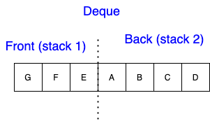
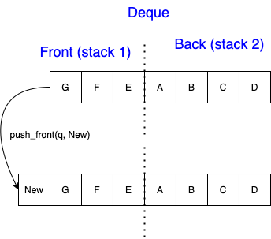
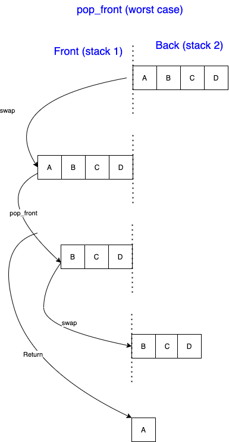
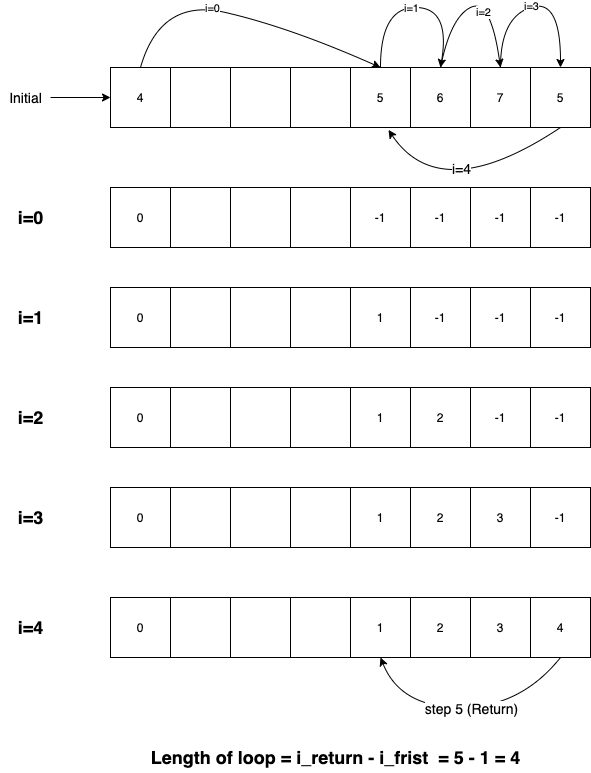

[](https://hackmd.io/p1bIKDGDSfKEOnCntsm6MA)

# Homework 1

Shao-Ting Chiu (r07945001@ntu.edu.tw)

## Problem 1 - Complexity (80pts + 20pts)

##### 1. (5pt)

- loop 執行次數大約為 $n$ 次, 為線性關係, 故複雜度為 $O(n)$

##### 2. (5pt)

- 執行次數大約為 $log_{2}(n) - 1$ (例如 $8=2^3=2\times \underbrace{2\times 2}_{2次}$). 因此複雜度為 $O(log(n))$ 

##### 3. (10pt)

Time complexity of recurive functions [^master]

$$
\begin{align}
  T(n) &= 4T(n-1) \\
  T(n) &= 4 (4 T(n-2)) \\
  T(n) &= 4^{n-c} 3T(c-1) \\
  T(n) &= 4^{n-c} 3^c  \\
  T(n) &= O(4^n)_{\#}
\end{align}
$$


##### 4. (10pt)

Becsue $f(n)$ and $g(n)$ are positively define for $n$ as a positive integer:

$$ 0 \leq max(f(n) + g(n)) \leq  f(n) + g(n) \leq 2\cdot max(f(n) + g(n))$$

for any $n\geq 1$.

We can find a $c_1\geq2$, such that fullfill the inequality:

   $$f(n) + g(n) \leq c_1 max(f(n)+g(n))$$

And also a $c_2 \leq 1$, satisfies

$$c_2 max(f(n)+ g(n)) \leq f(n) + g(n)$$

for all $n\geq 1$. Therefore, the euqlity holds by applying the definition of $\Theta(n)$ [^ITA_theta]


##### 5. (10pt)

Because $f(n) = O(i(n))$ and $g(n) = O(j(n))$, there exist two integers $n_1$, $n_2$ and two constants $c_1$, $c_2$ that satisfy the inequalities:

<center>

$f(n) \leq c_1 i(n_1)$ and $g(n) \leq c_2 j(n_2)$

</center>


Let $n_0 = max(n_1, n_2)$ and  $c_0 = c_1c_2$. Consider the equation $f(n)\cdot g(n)$:

$$f(n) \cdot g(n) \leq c_1 i(n) \cdot c_2 j(n) \leq c_0 i(n)j(n)$$ 

for all $n\geq n_0$. Thus $f(n)\cdot g(n) \leq O(i(n)\cdot j(n))_{\#}$ [^prop_o].

##### 6. (10pt)

The statement is **false**. Here is a contradictory  example:

Let $f(n) = 2 \log_{2} n$ ; $g(n) = \log_{2} n$. This example satisfy the condition, $f(n) = O(g(n))$. However, when apply this example in the power of 2. We can find that $2^{f(n)} = 2^{ 2 \log_{2} n} = n^2$, and $2^{g(n)} = n$[^log]. Therefore, in this case, $2^{f(n)} \notin O(2^{g(n)})_{\#}$.

##### 7. (10pt) The harmonic series

Strategy: **Approximation by Integrals** [^ITA_1154]

Let $f(k) = \frac{1}{k}$, which is a **monotonically decreasing function**. We can find the bounds

$$\int_{m}^{n+1} f(x)dx \leq \sum_{k=m}^{n} \frac{1}{k} \leq \int_{m-1}^{n} f(x) dx$$

For a **lower bound**,

$$\sum_{k=1}^{n} \frac{1}{k} \geq \sum^{n+1}_{1} \frac{1}{x} dx = \ln(n+1)$$

For an **upper bound**,


$$ \begin{align*} 
\sum_{k=2}^{n} \frac{1}{k} + 1 & \leq \int_{1}^{n} \frac{1}{x} dx + 1\\
                   & = \ln(n) + 1
\end{align*}$$

In summary,

$$\ln(n+1) \leq \sum_{k=1}^{n} \frac{1}{k} \leq \ln(n)+1$$

We need to find constants $c_1$ and $c_2$ that can include bounds by multply with $\ln(n)$.

- Lower bound:  $\ln(n+1) > 1 \cdot ln(n)$
  - where $c_1 = 1$ for $n \geq 1$
- Upper bound: $\ln(n) + 1 = \ln(e\cdot n) < 2\cdot \ln(n)$
  - where $c_2 = 2$ for  $n > e$

Therefore,

$$0\leq \ln(n) \leq \sum_{k=1}^{n} \frac{1}{k} \leq 2\ln(n)$$

for all $n>e$. By $\Theta$ notatoin: $\sum^{n}_{k=1} \frac{1}{k} = \Theta(\ln n) = \Theta(\frac{\log n}{\log e}) = \Theta(\log n)_{\#}$


##### 8. (10pts) $\log(n!) = \Theta(n\log n)$

The equation can be expanded

$$\log(n!) = \log(n) + \log(n-1) + \cdots + \log(1)$$

We can find the upper bound by setting all the terms as $\log(n)$, and get

$$\log(n!) \leq n\log(n)$$

On the other hand, $\log(n!)$ can be expanded 

$$\log(n!) = \log(n * (n-1) * (n-1) * \cdots * 1) $$

By removing half of elements,

$$\begin{align*}
  \log(n!) &\geq \log(n*(n-1)*\cdots*(\frac{n}{2})) \\
           &\geq \log((\frac{n}{2})^{\frac{n}{2}}) = \frac{n}{2} \log(\frac{n}{2})
\end{align*}$$

The relation between $n\log(n)$ and $\frac{n}{2} \log(\frac{n}{2})$ can be further explained

$$\frac{n}{2}\log(\frac{n}{2}) = \frac{n}{2}(\log(n) - 1)$$

We need to find a $c$ that fullfills the following inequality:

$$c\cdot n\log(n) \leq \frac{n}{2}\log(\frac{n}{2}) $$


For $n\geq 4$ [^log],

$$\begin{align*}
  \log n &\geq 2 \\
  \frac{1}{4} \log n   &\geq  \frac{1}{2} \\
  \frac{1}{4} \log n - \frac{1}{2} &\geq 0 \\
  \frac{1}{4} n \log n - \frac{1}{2} n &\geq 0 
\end{align*}$$ 

Add $\frac{1}{4}n\log n$ on both sides:

$$\frac{1}{2} n\log n - \frac{1}{2}n \geq \frac{1}{4} n\log n$$

Recall the lower bound

$$ \begin{align*}
  \log(n!) &\geq \frac{n}{2} \log(\frac{n}{2}) \\
           &\geq \frac{1}{4} n\log n
\end{align*}$$

for all $n\geq 4$.

In conclusion,


$$0\leq \frac{1}{4}n\log(n) \leq \log(n!) \leq n\log(n)$$

for all $n\geq 4$. The $\Theta(n!) = n\log(n)_{\#}$


##### 9. (10pts)

令 $g(n) = n\log n$.
每一個 $f(n)$ 都會產生 $2$ 個 $f(n-1)$. 直到  $\lfloor \frac{n}{2} \rfloor = 1$ 總計會產生 $n^{\log_2 2}$ 個 $\Theta(1)$ operations 在 leaves. 在分支的過程中, 會產生 $\sum_{j=0}^{\log_2 n - 1} 2^j g(\frac{n}{2^j})$ 個 operation 在 roots[^master_tree]. 所以可以得到以下關係

$$f(n) = \underbrace{\Theta(n^{\log_2 2})}_{Leaves} + \underbrace{\sum_{j=0}^{\lfloor \log_2 n - 1 \rfloor} 2^j g(\frac{n}{2^j})}_{Roots}$$


已知 $g(n) = \Theta(n\log n)$, 接下來比較 $2 g(\frac{n}{2})$ 和 $g(n)$ 的 complexity:


$$\begin{align*}
  2 g(\frac{n}{2}) &= 2 \cdot \frac{n}{2} \cdot \log(\frac{n}{2}) \\
                   &= n \cdot \log(\frac{n}{2}) \\
                   &= n \cdot (\log(n) - 1) \\
                   &< \underbrace{n\cdot \log(n)}_{=g(n)}
\end{align*}$$ 

for all $n>2$, 可以找到 $c<1$ 滿足 $2 g(\frac{n}{2}) < c\cdot g(n)$ 

另外下界可以用,

$$\begin{align*}
  2g(\frac{n}{2}) = log(\frac{n^n}{2}) & \geq log(n^{n/2}) \\
                                       & = \frac{1}{2} n\cdot \log(n)
\end{align*}$$ 

for $n\geq 4$. Furthermore, $\lim_{n\rightarrow \infty} \frac{log(n^n/2)}{log(n^{n/2})} = 2$ [^xpx]. Therefore, $2g(\frac{n}{2}) = \Theta(g(n))$

因此可以得到 roots 的 complexity,

$$\begin{align*}
\underbrace{\sum_{j=0}^{\lfloor \log_2 n - 1 \rfloor} 2^j g(\frac{n}{2^j})}_{Roots} &\leq \sum_{j=0}^{\lfloor \log_2 n - 1 \rfloor} c^j g(n) + O(1) \\
&\leq  g(n) \sum^{\lfloor \log_2 n - 1 \rfloor}_{j=0} c^j + O(1)\\
&= g(n) (\frac{1\cdot(1-c^{\lfloor \log_2 n - 1 \rfloor})}{1-c}) + O(1) \\
&= O(g(n))
\end{align*}$$

for $n>2$ and $c<1$. On the other hand, we can also find a lower bound by letting $c<\frac{1}{2}$ and $n>4$. Therefore

$$\underbrace{\sum_{j=0}^{\lfloor \log_2 n - 1 \rfloor} 2^j g(\frac{n}{2^j})}_{Roots} = \Theta(g(n))$$

Finally we get,

$$\begin{align*}
f(n) &= \Theta(n) + \Theta(n\log n) \\
     &= \Theta(n(\log(n))_{\#}
\end{align*}$$


##### 10. (Bonus 10pts) 
因為 $f_k(n) = O(n^2)$, 所以可以找到 $c>0$ 滿足 $f_k(n) \leq c \cdot n^2$.

$$\begin{align*}
\sum_{k=1}^{n}f_k(n) = \underbrace{f_1(n) +\cdots + f_n(n)}_{n} &\leq c_1n^2 + c_2n^2 + \cdots + c_nn^2 \\
 &= (c_1+\cdots+c_n)n^2\\
 &\leq n\cdot \max(c_1,\cdots,c_n) \cdot n^2 \\
 &= n^3 \cdot \max(c_1, \cdots, c_n) \\
 &= O(n^3)
\end{align*}$$

令 $c_{i}$ 為常數, 滿足 $f_{i}(n) \leq c_{i}n^2$. $i\in\{1,\cdots,n\}$

##### 11. (Bonus 10pts)

證明 $k=$ Euclidean algorithm $gcd(m,n)$ 的遞迴次數, 而且 $m>n$. 則 $y\geq F_k$, $F_k$ 是 $k^{th}$ Fibonacci number [^gcd3].


**Section 1: GCD 和 Fibonacci**

分析三個相連的步驟 $(m_{k+1}, n_{k+1})$, $(m_{k}, n_{k})$, $(m_{k-1}, n_{k-1})$. 則 $m_k = n_{k+1}$, $m_{k-1} = n_k$. 此外, $n_{k-1} = m_k~mod~n_k$, 所以 $m_k = q\cdot n_k + n_{k-1} $ 且 $q\geq 1$. 所以 $n_{k+1} \geq n_k + n_{k-1}$ 形成 Finbonacci 的不等式[^gcd]. 

而 $F_k \approx \frac{(\frac{1+\sqrt{5}}{2})^k}{\sqrt{5}}$[^gcd] (Section 2). 所以 $k = c\cdot \log(F_k) \leq O(log(m+n))_{\#}$

**Section 2: Fibonacci 的通式**

Fibonacci 數列是一個線性空間 (兩個 Fibonacci 數列 相加或相乘都是 Fibonacci[^fib])。 在這個定理基礎下，尋找等比的 Fibonacci series:

$$\begin{align}
  a_{n-2} \times r &= a_{n-1} \\
  a_{n-1} \times r &= a_n \\
  a_{n-2} + a_{n-1} &= a_n
\end{align}$$

結合上述三項性質，將前兩項帶入最後一項，得到

$$r^2 -r -1 =0$$

得到 $r$ 的兩個根為實根 $\alpha$ 和 $\beta$ , 代表可以找到 $a_{k} = p \alpha^{k-1} + q \beta^{k-1}$, 其中 $p$ 和 $q$ 可以用起始條件確定如($a_{1}=1$, $a_{2}=1$)


---

## Problem 2 - Stack / Queue (60pts)

##### 1. (10pts)


```julia {.line-numbers}
struct Queue
  head
  tail
  array  # Index starts at 0
  length # Length of array
end

function init_queue(length)
  Q = Queue()
  Q.head = 0
  Q.tail = 0
  Q.length = length
  Q.array = zeros(length) # malloc an array
  return Q
end

function enqueue(Q,x)
  # Check memory
  next_tail = (Q.tail+1) % Q.length

  if Q.head == next_tail
    raise OverflowError
  end

  Q.array[Q.tail] = x
  Q.tail = next_tail
end

function dequeue(Q)

  if Q.head == Q.tail
    raise UnderflowError
  end

  x = Q.array[Q.head]

  Q.head = (Q.head + 1) % Q.length

  return x
end

function front(Q)
  return Q.array[Q.head]
end

function size(Q)
  
  if Q.tail < Q.head
      s = Q.length - (Q.head - Q.tail)
  else
      s = Q.tail - Q.head
  end

  return s
end

function reverse(Q)
  q_tmp = init_queue(2) # Q(1)
  
  for i in 0:(size(Q)) # Q(n)
    x = dequeue(Q) # Q(1)
    enqueue(q_tmp, x) # Q(1)

    x = dequeue(q_tmp) # Q(1)
    enquque(Q) # Q(1)
  end
end
```

See design diagram [^queueD]

- Remarks: `reverse`
  - Emptness of helper queue:
    - `q_tmp` is initiated as an empty queue. Besides, `enqueue` and `dequque` are paired, which garantee `q_tmp` is empty after the `for loop`
  - $O(1)$ - extra space
    - `q_tmp` is initiated with fixed size `2`.


##### 2. (10pts)

- `init_queue`: $O(1)$
- `enqueue(Q,x)`: $O(1)$
- `dequeue(Q)`: $O(1)$
- `size`: $O(1)$
- `reverse` 內的 `for loop` 為一層, 執行次數與資料數 `n` 成正比, 所以是 $O(n) \in O(n^2)$. (見 pseudo code `reverse` 的複雜度註解)


##### 3. 

```julia {.line-numbers}
struct stack
  array
  length
end

struct deque
  front :: stack
  back :: stack
end

# Stack
function init_stack() # O(1)
  s = stack()
  s.length = 0
  s.array = []
  return s
end

function push(s::stack, x) # O(1)
  s.array[s.length] = x
  s.length = s.length  + 1
end

function pop(s::stack) # O(1)
  x = s.array[s.length - 1]
  s.length = s.length - 1

  return x
end


# Queue
function init_deque(q::deque) # O(1)
  q = deque()
  q.front = init_stack()
  q.back = init_stack()
end

function push_front(q::deque, x) # O(1)
  push(q.front, x)
end

function push_back(q::deque, x) # O(1)
  push(q.back, x)
end


function swap_to_empty(q::deque) # O(n)
  if (q.front.length == 0)
    while(q.back.length !=0)
      x = pop(q.back)
      push(q.front, x)
    end
  else if (q.back.length==0)
    while(q.front.length !=0)
      x = pop(q.front)
      push(q.back, x)
    end
  else
    raise error
end

function pop_front(q::deque) # max(O(1),  O(n)*2+O(1) )
  if q.front.length > 0
    pop(q.front)
  else
    swap_to_empty(q)
    pop(q.front)
    swap_to_empty(q)
  end
end

function pop_back(q::deque) # max(O(1),  O(n)*2+O(1) )
  if q.back.length > 0
    pop(q.back)
  else
    swap_to_empty(q)
    pop(q.back)
    swap_to_empty(q)
  end
end
```

- Deque formed by two stacks
  
- push_front
  
- pop_left 
  

##### p.4 (5pts)

`push_front` 使用的是 stack 的 `push` . 因此, time complexity 為 $O(1)$

##### p.5 (5pts)

同 `push_front` 使用 stack 的 `push`. Time complexity 為 $O(1)$

##### p.6 (5pts)

如果 `front` stack 還有 element, time complexity 為 stack `pop` 的 $O(1)$. 然和 worst-case 是 `front` 沒有剩下 element, 需要把 `back` 底層的 element pop 出來. 這個 pseudo code 使用的方法是, 把 `back` 一直 `pop`, 且 `push` 到 `front`. 接著 `front` pop 一次, 取得 return 後, 再搬移回去. 這個動作使用了 `while` 需要的 time complexity 為 O(n) 計算如下


$$O(\text{pop\_front}(q)) = \begin{cases}
O(1), \text{q.front.length>0}\\
\underbrace{O(n)}_{\text{swap to front}} + \underbrace{O(1)}_{\text{pop}} + \underbrace{O(n)}_{\text{swap back}}, \text{q.front.length=0}\\
\end{cases}$$

而 $O$ 是 worst-case 複雜度, 因此 `pop_front` 的時間雜度為 $O(n)$.

##### p.7 (5pts)

同 `HW2 p.6` 的解釋, time complexity 為 $O(n)$. 


##### p.8 (10 pts)

當加入 $n$ 個 `push`, 每當遇到 $3$ 的指數就要執行一次`enlarge` operation ($O(m)$). 因此可以得到在以下次數需要做 `enlarge` [^dymarray]:

$$1,3,9,27,\cdots, 3^{\lfloor \log_{3}n \rfloor}$$

例如當 $n=10$, $3^{\lfloor \log_{3}n \rfloor} = 3^{2}=9$, 就要在 $\{1,3,9\}$ 的時候 `enlarge`. 因此可以得到

|執行次數|執行時間|
|---|---|
|$$1,3,9,27,\cdots, 3^{\lfloor \log_{3}n \rfloor}$$|$1c, 3c, 9c, 27c,\cdots, 3^{\lfloor \log_{3}n \rfloor} c$|

$c$ 是常數, 使得 `enlarge` 為 $m\cdot c \in O(m)$.

因此當 `push` $n$ 次,  `enlarge` 所需的總時間 $T$ 為:

$$\begin{align*}
T &= c\cdot (\underbrace{1+3+\cdots+3^{\lfloor \log_{3}n \rfloor}}_{\lfloor \log_{3}n \rfloor + 1})\\
  &= c\cdot\frac{1\cdot(1-3^{\lfloor \log_{3}n \rfloor + 1})}{1-3}\\
  &= c' \cdot (3^{\lfloor \log_{3}n \rfloor})\\  
  &\leq c' \cdot n \in O(n)
   \end{align*}$$

除此之外, `createstack` 需要 $O(1)$, `isFullStack` 需要 $O(1)$，因為這些操作沒有考慮到 `m` [^stack].

值得一提的概念是 **amortized analysis**, 在絕大多情況下, `enlarge` 很少發生. 因此對於單次操作而言, 只要沒有遇上 $3$ 的指數的限制下, 就會是 $O(1)$. 然而 $O$ 是最糟情況, 這個問題的複雜度為 $O(n)_{\#}$.

## Problem 3 - Array / Linked Lists (60pts)

### 1. (15pts)

```julia {.line-numbers}
function is_jumping_forever(A, i_init)

  A_record = fill(False, length(A)) # Initiate record array with False

  i = i_init
  is_forever = False

  while (A_record[i] != True)

    if (A[i] == i)
      break
    else 
      A_record[i] = True
      i = A[i]
    end

  end

  is_forever = (A_record[i] == True) ? True : False

  return is_forever
  end
end
```

**Workflow**

只要

1. 展開一條一樣長度的 Array, 全部填滿 `False`
2. `While loop` : 
   1. 從起始點開始走, 如果遇到 `A[i]=i` 就跳出
   2. 如果 `A[i] != i`, 紀錄走過的地方在 `A_record[i]` 標記 `True`
   - 每次迴圈開始要件, 不能走過被標記過的點
3. 回傳: 如果最後一步是走過的, 代表已達終點; 反之, 如果最後一步是 `True` 則代表會 jump forever.

**Time and Space Complexity**

- Time complexity
  - $O(n)$: 最糟情況是跳到全部的 elements 才回來, 也就是 `while loop` 執行了 `n` 次
- Space complexity
  - $\Theta(n)$: 使用了一樣長度的 array 和固定大小的 temporary variables.

### 2. (15pts)

```julia {.line-numbers}
function loop_size(A, i_init)

  A_record = fill(-1, length(A)) # Initiate record array with -1

  i = i_init
  num_step = 0
  is_forever = False

  while (A_record[i] == -1)
      A_record[i] = num_step
      i = A[i]
      num_step+=1
  end

  loop_size = num_step - A_record[i]

  return loop_size
  end
end
```


**Workflow**

1. 建立一個 `record array`。預設值為-1
2. 迴圈: 每走一步, 紀錄當下的步數在 `record array`
3. 如果遇到的點已經被記錄, 跳出迴圈
4. 將當下的步數減掉上次來的步數, 得到 `loop` 的長度



**Time and Space Complexity**

- Time Complexity
  - $O(n)$: 需要走完一次的迴圈, 迴圈最大可以是 array 的長度 `n`
- Space complexity
  - $\Theta(n)$: 需要產生一樣長度的 `record array` 長度為 `n`, 再加上其他常數記憶體用量.


### 3. (15pts)

**分析**

因為是求中位數, 可以知道 

$$\begin{align*}
\max(M_{0,i}, M_{i,j}, M_{j,n}) &= M_{j,n} \\
\min(M_{0,i}, M_{i,j}, M_{j,n}) &= M_{0,i}
\end{align*}$$

所以 $M_{i,j}$ 越小越好, 也就是 $\min~f$ 發生在 $j=i+1$ 時, 接下來要尋找的就是在 $n-3$ 的空間中找到最適當的斷點. 接著使用 線性 尋找 $O(n)$, 朝 minimium 前進. 記憶體佔用為 $O(h)$ 用來存放 array. 使用 array 查找 median 為常數時間. 


```julia {.line-numbers}
# Find i, j 

function GetMedian(arr, s, t)
    if (s+t)/2 is odd
      return arr[(s+t)/2]
    else
      return (arr[s+t/2] + arr[s+t/2 + 1])/2
    end
end

function find_ij(arr)
  f = maximum(arr) # default value of f
  I = 0 # default i
  for i in 1 : (length(arr)-1 - 2) #last three elements
    m0 = GetMedian(arr, 0, i)
    m1 = arr[i+1] #minimum length of [i,j)
    m2 = GetMedian(arr, i+2, length(arr)-1)

    f_candidate = m2 - m0

    if (f_candidate < f)
      f = f_candidate
      I = i #update new I
    end
  end
  return I, I+1 # i, j
end
```

### 4. (15pts) Circular linked list

假設一個遞增序列

$$a_{n}\rightarrow a_{n-1}\rightarrow \cdots\rightarrow a_{1}$$

滿足 $a_{i} < a_{j}$ 當 $i<j$. 因為排序好的序列在 circular linked list 會使 $a_{1} \rightarrow a_{n}$ 產生一個 decreasing node. 將 circular linked list 遞增排序的步驟:

1. 找到 decreasing nodes ($O(n)$), 把他們從 circular 切出來, 將 previous node 和 next node 連起來 ($O(1)$)
2. 找到 minimum bigger value ($O(n)$), 將數字切進去 ($O(1)$)
3. 如果沒有 bigger value, 找到 minimum value 連起來


```julia {.line-numbers}

function insertSort(head, value)
    node1 = head
    node2 = node1.next
    node3 = node1.next.next

    val = value

    while (node2 != head)
      
      if (node2.)

      #move next
      node1 = node1.next
      node2 = node2.next
      ndoe3 = node3.next
    end
end

function make_sorted(head::node)
  node1 = head
  node2 = node1.next
  node3 = node1.next.next

  decNodes = []

  while (node2 != head)
    if (node2.value > node3.value)
        link(node1 -> node3)
        append!(decNodes, node2)
        if (length(decNodes) == 2)
          break
        end
    end

    #move next
    node1 = node1.next
    node2 = node2.next
    ndoe3 = node3.next
  end

  #rewiring 
  nodeA, nodeB = decNodes

  #find new cite to wire


end
```


[^master]: Time complexity of recursive functions [Master theorem]. https://yourbasic.org/algorithms/time-complexity-recursive-functions/
[^ITA_theta]: Cormen, T. H., Leiserson, C. E., Rivest, R. L., & Stein, C. (n.d.). Introduction to Algorithms, Third Edition. **pp.44-47**
[^prop_o]: Properties of Big-O. Data Structures and Algorithms with Object-Oriented Design Patterns in Java. [[Link](https://book.huihoo.com/data-structures-and-algorithms-with-object-oriented-design-patterns-in-java/html/page62.html)]
[^log]: $b^{\log_b p} = p$. see [log equalities](https://ducdoan.com/wp-content/uploads/2018/12/2.jpg).
[^ITA_1154]:  Introduction to Algorithms, Third Edition. **pp.1154-1156**.
[^log]: How to prove $\log n! = \Theta(n\log n)$. [[tutorial](http://www.mcs.sdsmt.edu/ecorwin/cs372/handouts/theta_n_factorial.htm)]
[^master_tree]: Introduction to Algorithms, Third Edition. Chapter 4 Divide-and-Conquer. **pp.104**
[^xpx]: $\lim_{n\rightarrow \infty} \frac{log(n^n/2)}{log(n^{n/2})} = 2$. Becuase both nominator and denominator approach to infinity as $n \rightarrow \infty$. We can use [L'Hospital's Rule](https://en.wikipedia.org/wiki/L%27H%C3%B4pital%27s_rule). $\lim_{n\rightarrow \infty} \frac{log(n^n/2)}{log(n^{n/2})} = \lim_{n\rightarrow \infty} \frac{log(n^n/2)'}{log(n^{n/2})'}$. Later on, $\frac{d \log(n^n/2)}{dn} = \frac{1}{2}\log(n^n)'$[^lhos]; $\frac{d \log(\frac{n^n}{2})}{dn} = \log(n^n)'$ . Therefore, $\lim_{n\rightarrow \infty} \frac{log(n^n/2)}{log(n^{n/2})} = 2$
[^lhos]: $(x^x)' = x^x (\log(x) + 1)$. [[proof](https://jakubmarian.com/derivative-of-xx/)]
[^gcd]: Euclidean algorithm. [[link](https://codility.com/media/train/10-Gcd.pdf)]
[^gcd2]: Euclidean algorithm for computing the greatest common divisor. [[link](https://cp-algorithms.com/algebra/euclid-algorithm.html)]
[^gcd3]: Lame's Theorem. [[link](https://www.nitt.edu/home/academics/departments/cse/faculty/kvi/Euclidean%20algorithm%20for%20gcd.pdf)]
[^queueD]: Design diagram of reversing a queue with a temporary queue. Noted that the initial queue contains `[3,2,1]` with `1` at the front.

[^dymarray]: Dynamic Array Amortized Analysis. [[link](https://www.interviewcake.com/concept/java/dynamic-array-amortized-analysis)]
[^stack]: Implementation of a dynamic stack
    ```c {.line-numbers}
    struct Stack {
    int top;
    int capacity;
    int *arr;
    }

    struct Stack *createStack() { // O(1)
    struct Stack *S = malloc(sizeof(struct Stack));
    S->capacity = 1;
    S->top = -1;
    S->arr = (int*)malloc(S->capacity * sizeof(int));
    return S;
    }

    int isFullStack(struct Stack *S) { // O(1)
    return (S->top == S->capacity-1);
    }

    void enlarge(struct Stack *S) { // O(3*m)
    int new_capacity = (S->capacity * 3);
    S->capacity = new_capacity;
    S->arr = (int*)realloc(S->arr, new_capacity * sizeof(int));
    }

    void push(struct Stack *S, int data) {
    S->arr[++S->top] = data; // O(1)
    if (isFullStack(S))
      enlarge(S);
    }
    ```
  [^fib]: 費波那契數列. [[PDF](http://www.hwsh.tc.edu.tw/ischool/public/resource_view/open.php?file=b38c393be59da9b7e5acb45bde07b8c7.pdf)]