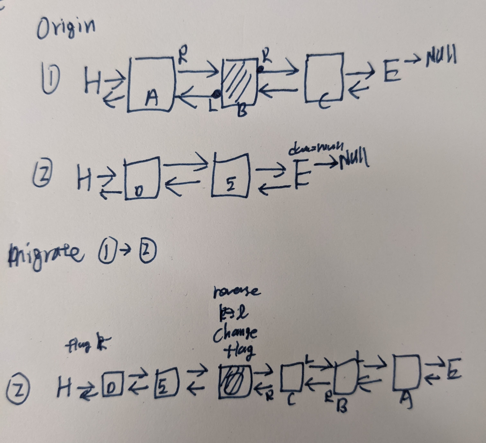
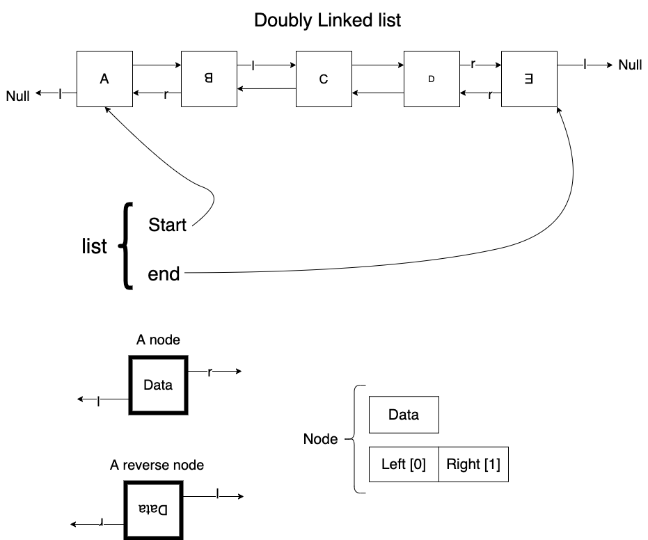
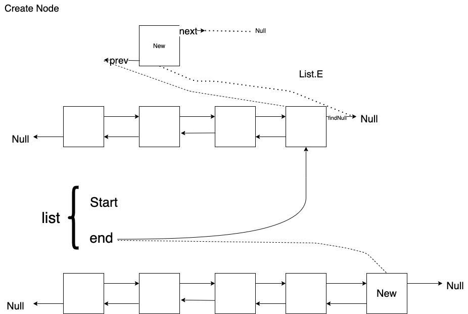
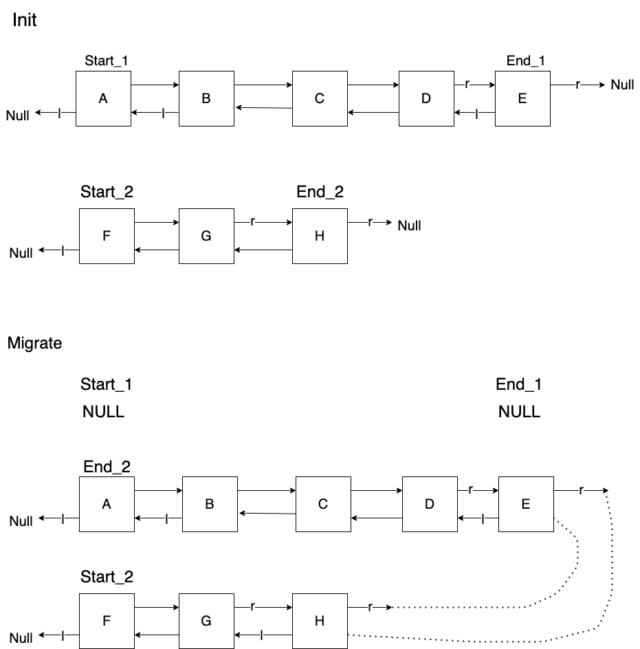
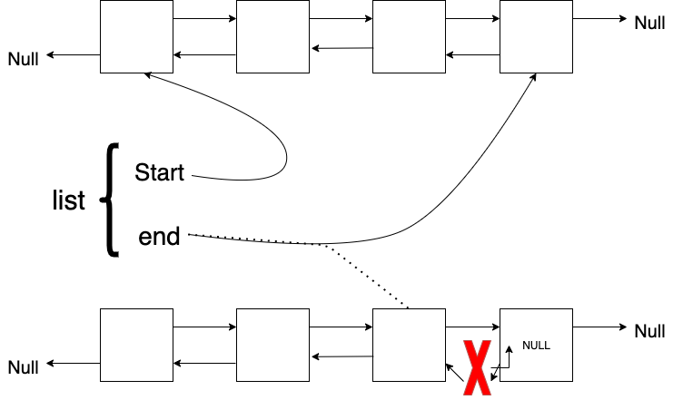

# Double Linked List: List migration

## Requirement

- Time limit: 1s
- Mem Limit: 65536 KB


## Constraint

- n of cargos: max 10e6
- k of lines: 10e3
- l is the index: [0,10e4]

## Printout

- print logs from 0-(k-1) lines
- skip null line

## Plan



- Reader
    - Parse a string
    - Parse an int
    - Parse an int 
    - Terminate for EOF


## Implementation of Double linked list



https://gist.github.com/mycodeschool/7429492


### List

```c
struct list{
    node* start
    node* end
}
```

### Array of lists

```
list[1000]
```

### node

```c
struct node{
    int data
    node* neighbor[2] # [left_ptr, right_ptr]
}
```

### Read a list

```julia
function read(list)
    if list.start != NULL { # 至少有一個
      iter_read(first_node)
    }
    else { # 空集合
      return 0
    }
end

function iter_read(node){

  flag = get_node_ptr_from_terminal(node) # 得到下個 node 的方向
  
  print(node)

  if (flag== -1){ #兩邊都是 NULL
    return 0
  }
  
  ptr_pre = &node # 第一個 node 的位置
  
  while(node.neighbor[flag] != NULL){ # terminate at NULL
    # move to new node
    node = node.neihbor[flag]

    # Print 
    print(node)

    # Update direction
    if (node.neighbor[flag] == ptr_pre){ # case: turn back
        flag = flag^1
    }

    # Move
    ptr_pre = &node
  }
}


function get_node_ptr_from_terminal(node){

  left =  node.neigbhor[0] 
  right = node.neighbor[1]

  if left==NULL and right == NULL
    return -1

  if left != NULL and right == NULL
    return 0
  
  if left == NULL and right != NULL
    return 1

  if left != NULL and right != NULL
    return Error
}
```


## Enter



- Pointers
  - End node
    - `NULL` to `new node`
  - new node
    - one -> End node
    - the other -> `NULL`

```julia
function EnterLine(list, new_node)

  if list.end == NULL { # Enter an empty line 
    list.start = &new_node
    list.end = &new_node
  }

  end_flag = get_NULL_from_terminal(list.end)

  # Pointer Assignment
  list.end.neighbor[end_flag] = &new_node
  new_node.neighbor[end_flag] = NULL
  new_node.neighbor[end_flag^1] = list.end

  # Update END
  list.end = &new_node
end


function get_NULL_from_terminal(node){

  left =  node.neigbhor[0] 
  right = node.neighbor[1]

  if left==NULL and right == NULL
    return 2

  if left != NULL and right == NULL
    return 1
  
  if left == NULL and right != NULL
    return 0

  if left != NULL and right != NULL
    return -1
}
```


## Migrate



```julia
function migrate(list src, list dst){

  # Locate ends
  end_src = src.end
  end_dst = dst.end

  # Get flag
  src_flag = get_NULL_from_terminal(end_src)
  dst_flag = get_NULL_from_terminal(end_dst)

  # Bridging
  end_src.neighbor[src_flag] = end_dst
  end_dst.negihbor[dst_flag] = end_src

  # Relocate the terminals
  dst.end = src.start

  # Clean up src 
  src.start = NULL
  src.end = NULL
}
```

## Leave




```julia

function leave(list){
  end_node = list.end

  flag = get_node_ptr_from_terminal(end_node)
  prev_node = end_node.neighbor[flag]
  list.end =  prev_node

  kill(end_node)
}
```


## Memory

- Node
    - 1 x `int`: 4 byte
    - 2 x `pointer`: 8 bytpe
    - Sum: 20 byte
    - 10e6 nodes: 
        - 20 MB


## References

1. XOR linked list. [[wiki](https://en.wikipedia.org/wiki/XOR_linked_list)]

2. Image (Edite on Diagrams)
   1. [Plan](https://app.diagrams.net/#Hstevengogogo%2FDSA-WastonAbili%2Fmain%2Fimg%2FPlan.png)
   2. [Enter](https://app.diagrams.net/#Hstevengogogo%2FDSA-WastonAbili%2Fmain%2Fimg%2FEnter.png)
   3. [Migrate](https://app.diagrams.net/#Hstevengogogo%2FDSA-WastonAbili%2Fmain%2Fimg%2FMigrate.png)
   4. [Leave](https://app.diagrams.net/#Hstevengogogo%2FDSA-WastonAbili%2Fmain%2Fimg%2FLeave.png)