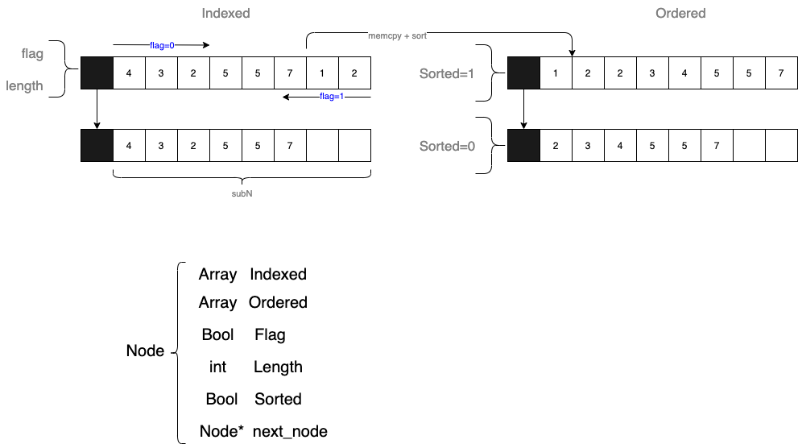
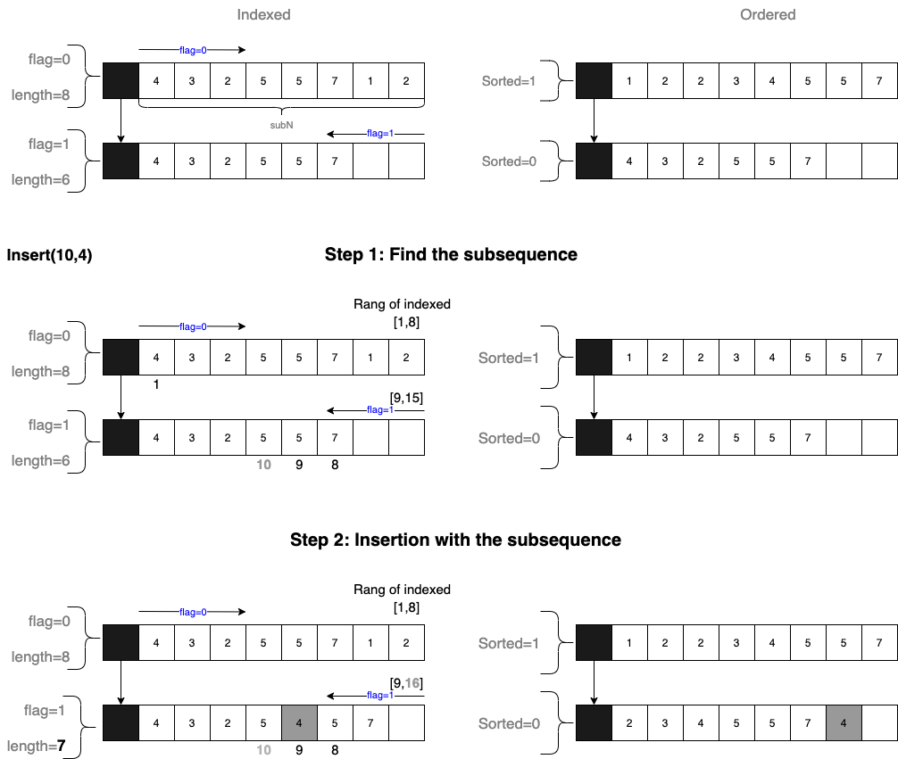
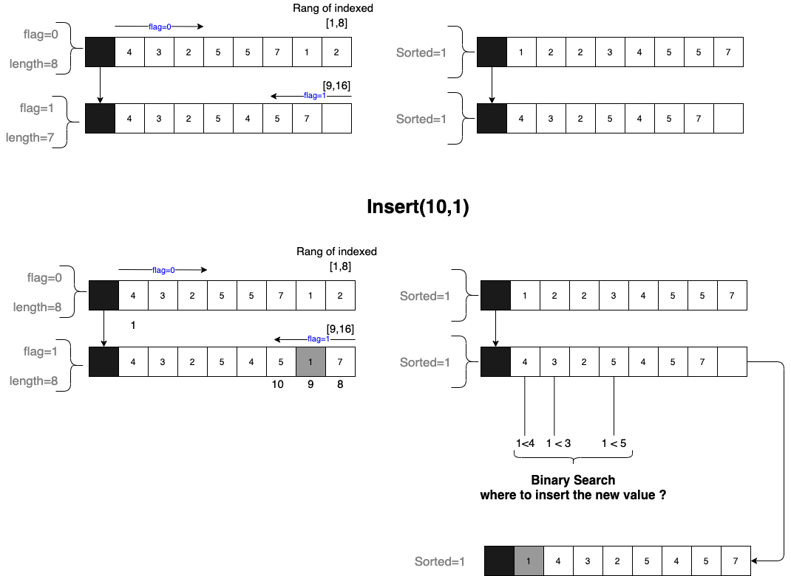
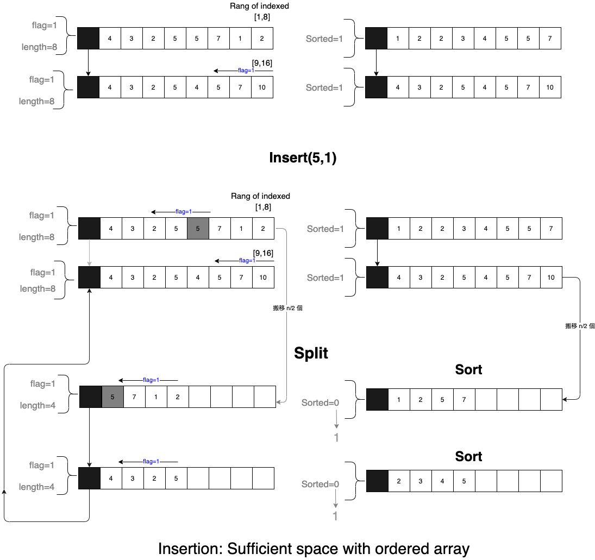
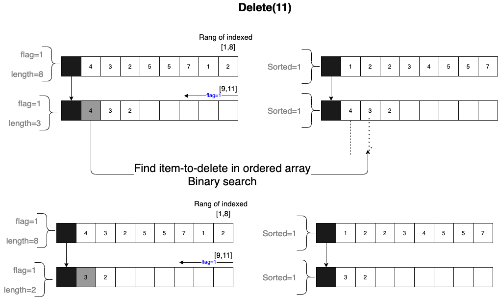
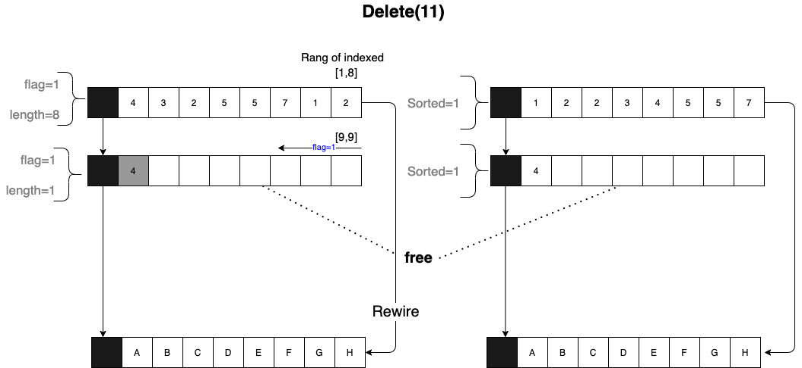
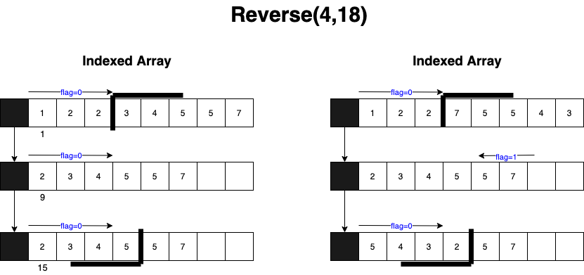
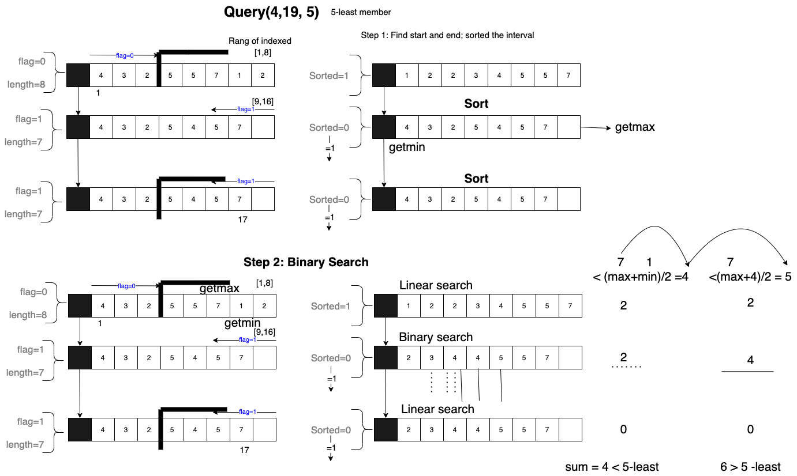

# K-least element

## Iinked Array



- 分為
  1. 排好先後的數列 (indexed) 
  2. sorted 的數列 (ordered)
- 每個 [Unrolled linked list](https://en.wikipedia.org/wiki/Unrolled_linked_list) 的參數
  - `flag`: 
    - `0`: 從 `0 -> N-1`
    - `1`: 從 `N-1 -> 0`
  - `length`:
    - array 中的資料量 (<`subN`)


## Insert

### Insertion with unordered / sufficient space




- Procedures
  - Find subarray
  - Find the i th element
  - Insert value into indexed array
  - Append value into unsorted array


### Insertion with Ordered / sufficient space




### Insertion with Orderd / insufficient space





## Deletion

## Deletion with remaining data




### Deletion with garbage collection




## Reverse




## Query



## Binary Search Algorithm
```julia
function binary_search(A, n, T) is
    L := 0
    R := n − 1
    while L ≤ R do
        m := floor((L + R) / 2)
        if A[m] < T then
            L := m + 1
        else if A[m] > T then
            R := m − 1
        else:
            return m
    return unsuccessful
```

## Query

## Copy an array


```c
void *memcpy(void *dest, const void *src, size_t n);
```


## Find i th element


### Unrolled linked list


### Skip List


Ref: [GreekforGeek](https://www.geeksforgeeks.org/skip-list-set-3-searching-deletion/)

## Reverse Linked list


- Ref
  - [用 Stack 反轉 linked list](https://ithelp.ithome.com.tw/articles/10213275)
  - [Reverse linked list](https://algorithm.yuanbin.me/zh-tw/linked_list/reverse_linked_list.html)


## Binary search algorithm when finding the k-least element


https://www.geeksforgeeks.org/kth-smallest-element-in-a-subarray/


## First strictly greater element in sorted array

```c
int next(int arr[], int target, int end)
{
 int start = 0;
  
    int ans = -1;
    while (start <= end)
    {
        int mid = (start + end) / 2;
  
        // Move to right side if target is
        // greater.
        if (arr[mid] <= target)
            start = mid + 1;
  
        // Move left side.
        else
        {
            ans = mid;
            end = mid - 1;
        }
    }
  
    return ans;
```

- Ref: [GreeekforGeek](https://www.geeksforgeeks.org/first-strictly-greater-element-in-a-sorted-array-in-java/)

## Insert an element into sorted array


- Ref: [[GreekforGeek](https://www.geeksforgeeks.org/search-insert-and-delete-in-a-sorted-array/)]

## Quick Sort 


Ref: Quick sort in C. [[link](https://openhome.cc/Gossip/AlgorithmGossip/QuickSort3.htm)]


## Usage

### Make File

- `make TEST`
  - [`test/test.sh`](test/test.sh)
- `make GenData`: generate random data
  - [`test/genData.sh`](test/genData.sh)


---
## References
1. https://leetcode.com/problems/kth-smallest-element-in-a-bst/solution/
    