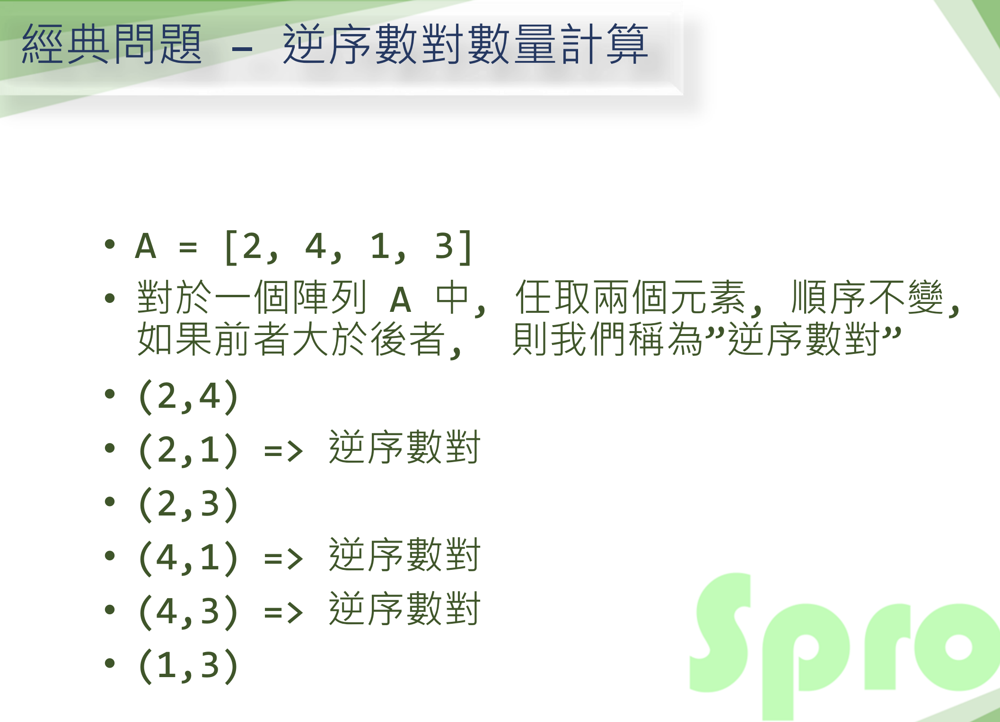
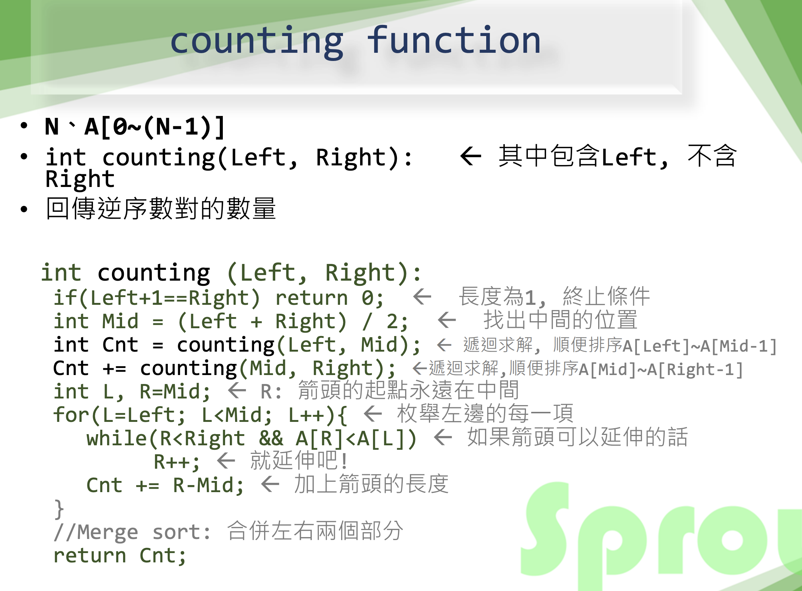
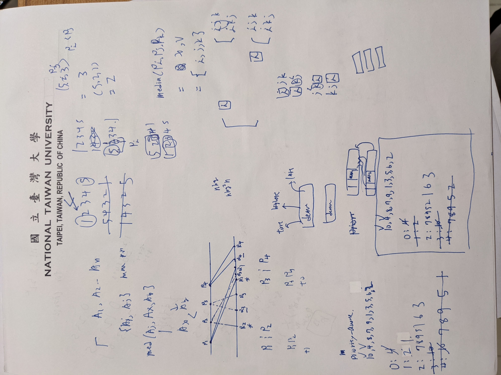
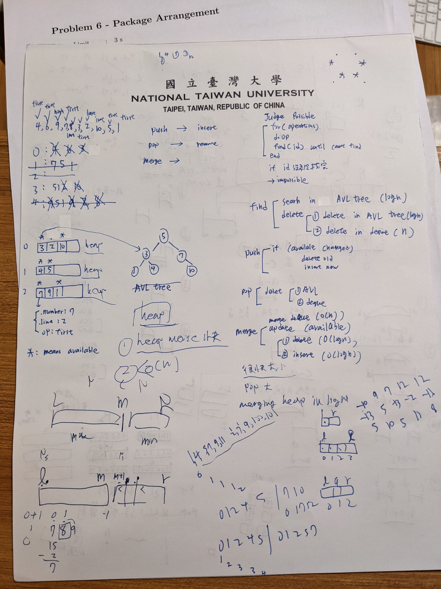
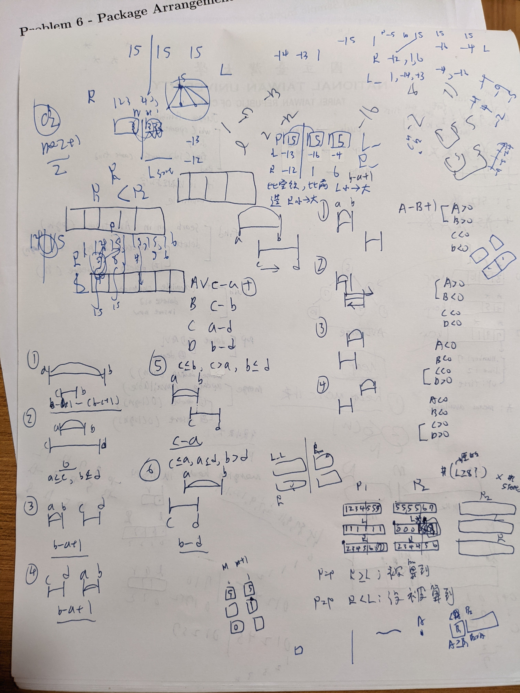

# Intersecting Triangles


## Strategy

```cpp
int counting(left, right)
    if (left+1 == right)
        return 0
    mid = (left + right) / 2
    cnt = counting(left, mid)
    cnt += counting(mid,left)

    r = mid
    for l = left to mid
        while (r<right && A[l]>A[r]) //l<r
            r++
        cnt += r-mid

    return cnt
```

1. Convert `Q`, and `R` to `max` and `min`
2. Sort `P` along with `max`, `min`
3. Sort `max` and `min` at the same time with sorted P


## Count inversions with C

```c

// C program to Count
// Inversions in an array
// using Merge Sort
#include <stdio.h>
#include <stdlib.h>
 
int _mergeSort(int arr[], int temp[],
               int left, int right);
int merge(int arr[], int temp[],
          int left, int mid,
          int right);
 
/* This function sorts the input array and returns the
   number of inversions in the array */
int mergeSort(int arr[], int array_size)
{
    int* temp = (int*)malloc(sizeof(int) * array_size);
    return _mergeSort(arr, temp, 0,
                      array_size - 1);
}
 
/* An auxiliary recursive function
   that sorts the input
  array and returns the number
  of inversions in the array.
*/
int _mergeSort(int arr[], int temp[], int left, int right)
{
    int mid, inv_count = 0;
    if (right > left)
    {
        /* Divide the array into two parts and call
       _mergeSortAndCountInv() for each of the parts */
        mid = (right + left) / 2;
 
        /* Inversion count will be the sum of inversions in
        left-part, right-part and number of inversions in
        merging */
        inv_count += _mergeSort(arr, temp, left, mid);
        inv_count += _mergeSort(arr, temp, mid + 1, right);
 
        /*Merge the two parts*/
        inv_count += merge(arr, temp, left, mid + 1, right);
    }
    return inv_count;
}
 
/* This funt merges two sorted
   arrays and returns inversion
   count in the arrays.*/
int merge(int arr[], int temp[], int left, int mid,
          int right)
{
    int i, j, k;
    int inv_count = 0;
 
    i = left; /* i is index for left subarray*/
    j = mid; /* j is index for right subarray*/
    k = left; /* k is index for resultant merged subarray*/
    while ((i <= mid - 1) && (j <= right)) {
        if (arr[i] <= arr[j]) {
            temp[k++] = arr[i++];
        }
        else
        {
            temp[k++] = arr[j++];
 
            /*this is tricky -- see above
             * explanation/diagram for merge()*/
            inv_count = inv_count + (mid - i);
        }
    }
 
    /* Copy the remaining elements of left subarray
   (if there are any) to temp*/
    while (i <= mid - 1)
        temp[k++] = arr[i++];
 
    /* Copy the remaining elements of right subarray
   (if there are any) to temp*/
    while (j <= right)
        temp[k++] = arr[j++];
 
    /*Copy back the merged elements to original array*/
    for (i = left; i <= right; i++)
        arr[i] = temp[i];
 
    return inv_count;
}
 
/* Driver code*/
int main(int argv, char** args)
{
    int arr[] = { 1, 20, 6, 4, 5 };
    printf(" Number of inversions are %d \n",
           mergeSort(arr, 5));
    getchar();
    return 0;
}
```

Ref: https://www.geeksforgeeks.org/counting-inversions/

## How to know two triangles have intersection(s)?

Let points on two distinct triangles be `(P,Q,R)` and `(P',Q',R')`.

- No intersection happens when
  - `P` > `P'` and `min(Q',R') > max(Q,R)`
- Intersection happens: Otherwise


## Range of `Int`

- `Int`: 4 bytes
  - 32 bit (1 byte = 8 bit)
  - Range: -2^31 ~ 2^31-1
- Belongs to the range  

**Ref**: https://www.tutorialspoint.com/cprogramming/c_data_types.htm


## Hints

### 排序

1. 排序 `P`
2. 左邊 `max`
3. 右邊 `min`
4. 

### 逆序述對 

- 定義
  - `A[i] > A[j]`
  - `i<j`


- 計算逆序數對


**Ref**: 
- https://www.csie.ntu.edu.tw/~sprout/algo2016/ppt_pdf/divide_and_conquer.pdf
- https://medium.com/@ssbothwell/counting-inversions-with-merge-sort-4d9910dc95f0


### Merge sort

```c
#include <stdio.h>
#include <stdlib.h>


// Merge two subarrays of A[].
// First subarray is arr[head..mid]
// Second subarray is arr[mid+1..tail]
void merge(int arr[], int head, int mid, int tail){
  int lenA = mid - head + 1;
  int lenB = tail - (mid + 1) + 1;
  int A[lenA];
  int B[lenB];

  //Copy data to temp arrays A[] and B[]
  int i, j, k;
  for(i = 0; i < lenA; i++){
    A[i] = arr[head + i];
  }
  for(j = 0; j < lenB; j++){
    B[j] = arr[mid + 1 + j];
  }

  // Merge two temp arrays back into arr[head..tail]
  i = 0;
  j = 0;
  k = head;
  //while array A and B haven't finished scanning
  while(i < lenA && j < lenB){
    if(A[i] < B[j]){
      arr[k] = A[i];
      i++;
    }
    else{
      arr[k] = B[j];
      j++;
    }
    k++;
  }

  //Copy the remaing elements into arr[], if A[] haven't finished scanning
  while(i < lenA){
    arr[k] = A[i];
    i++;
    k++;
  }
  //Copy the remaing elements into arr[], if B[] haven't finished scanning
  while(j < lenB){
    arr[k] = B[j];
    j++;
    k++;
  }
}

void merge_sort(int arr[], int head, int tail){
  if(head < tail){
    int mid = (head + tail) / 2;
    merge_sort(arr, head, mid);
    merge_sort(arr, mid+1, tail);
    merge(arr, head, mid, tail);
  }
}


int main(){
  int count, i;
  scanf("%d", &count);

  int list[count];
  printf("Numbers to be sorted: ");
  for(i = 0; i<count; i++){
    scanf("%d", &list[i]);
    printf("%d ", list[i]);
  }
  printf("\n");

  merge_sort(list, 0, count-1);

  printf("Numbers Sorted: ");
  for(i = 0; i<count; i++){
    printf("%d ", list[i]);
  }

  return 0;
}
```

**Ref**: 
- https://kopu.chat/2017/08/10/%E5%90%88%E4%BD%B5%E6%8E%92%E5%BA%8F-merge-sort/


## Merge sort in CLRS


### Merge Sort

```cpp
MERGE_SORT(A,p,r)
  if p<r
    q = round( (p+r)/2 )
    MERGE-SORT(A,p,q)
    MERGE-SORT(A,q+1, r)
    MERGE(A,p,q,r)
```


### Merge

```cpp
MERGE(A,p,q,r)
  n1 = q - p + 1 // length of sub-array 1 [str, end]
  n2 = r - q // (str, end]
  let L[1..n1+1] and R[1..n2+1] be new arrays
  for i = 1 to n1
    L[i] = A[p+i-1]

  for j = 1 to n2
    R[j] = A[q+j]

  L[n1+1] = inf
  R[n2+1] = inf

  i = 1
  j = 1
  for k = p to r
    if L[i] <= R[j]
      A[k] = L[i]
      i = i+1
    else 
      A[k] = R[j]
      j = j + 1 
```

## Draft


---

## Returning array in C


Ref: https://www.javatpoint.com/return-an-array-in-c


## Copy array with `memcpy`

https://stackoverflow.com/questions/2681061/memcpy-what-should-the-value-of-the-size-parameter-be


## Draft

- 
- 
- 
